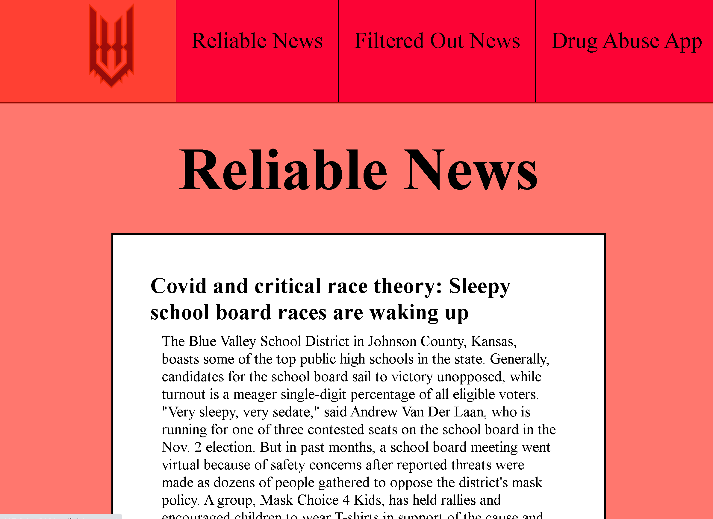
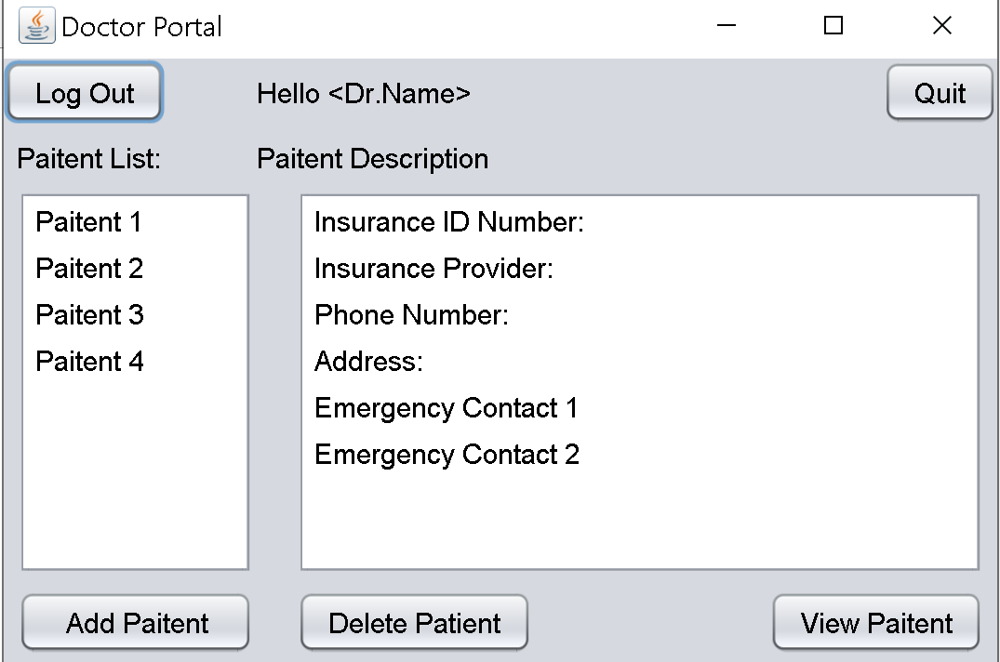

# UMSL Hackathon 2021 - Automate It

## The problems
<ol>
    <li>Fake Information / Disinformation</li>
    <li>Substance Abuse and Addiction</li>
</ol>

## How we thought to solve them
<ol>
    <li>A web application that automates filtering out unreliable news articles using machine learning</li>
    <li>A personal graphical application that patient input and confirmation</li>
</ol>

---

## Project Overview

## 1. Flask Web App
### Technologies Used:
<ul>
    <li>Python</li>
    <li>Flask</li>
    <li>Beautiful Soup</li>
    <li>Sklearn</li>
</ul>

{width: 50px;}

## 2. Java GUI App
### Technologies Used:
<ul>
    <li>Java</li>
    <li>Swing</li>
    <li>MySQL Database</li>
</ul>

{width: 40px;}


---

## Setup Requirements

### Flask App
<ol>
    <li>
    ```
    pip install flask, beautifulsoup4, pandas, sklearn
    ```
    </li>
    <li>Python3 installed</li>
</ol>

### Java App
<ol>
    <li>
    MySQL installation
    </li>
    <li>JRE 1.8 or greater</li>
</ol>
